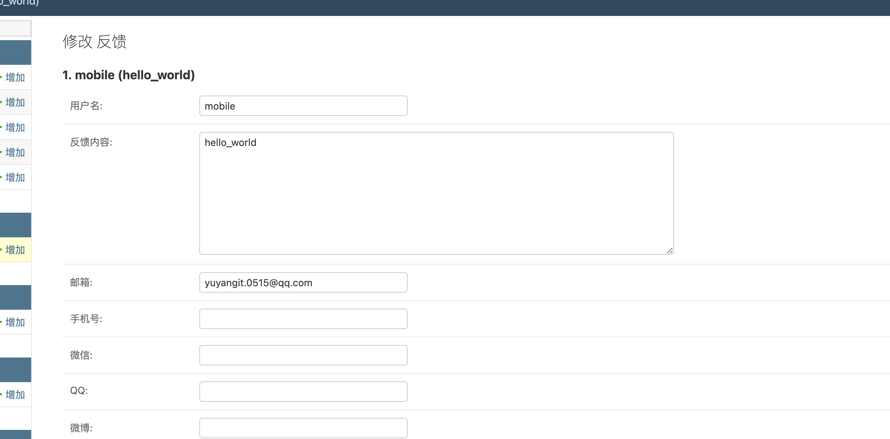

<!--
 * @Author: 余洋 yuyangit.0515@qq.com
 * @Date: 2024-10-18 13:02:23
 * @LastEditors: 余洋 yuyangit.0515@qq.com
 * @LastEditTime: 2024-10-23 20:51:38
 * @FilePath: /xy_request_handler__feedback/README.md
 * @Description: 这是默认设置,请设置`customMade`, 打开koroFileHeader查看配置 进行设置: https://github.com/OBKoro1/koro1FileHeader/wiki/%E9%85%8D%E7%BD%AE
-->
# xy_request_handler__feedback

- [简体中文](readme/README_zh_CN.md)
- [繁体中文](readme/README_zh_TW.md)
- [English](readme/README_en.md)

## 说明

基于xy_request_handler_api的反馈请求业务类，封装了常用功能，方便快速开发.

## 源码仓库

- <a href="https://github.com/xy-web-service/xy_request_handler__feedback.git" target="_blank">Github地址</a>  
- <a href="https://gitee.com/xy-web-service/xy_request_handler__feedback.git" target="_blank">Gitee地址</a>

## 安装

```bash
# bash
pip install xy_request_handler__feedback
```

## 使用

##### 1. 引入xy_django_app_feedback模型.(xy_request_handler__feedback依赖该模型,必须引入)

> 详情请查看 [settings.py](./samples/xy_web_server_demo/source/Runner/Admin/xy_web_server_demo/settings.py)

```python
# settings.py
INSTALLED_APPS = [
    "django.contrib.admin",
    "django.contrib.auth",
    "django.contrib.contenttypes",
    "django.contrib.sessions",
    "django.contrib.messages",
    "django.contrib.staticfiles",
    "Demo",
    "Resource",
    "Media",
    "xy_django_app_information",
    "xy_django_app_resource",  # xy_django_app_feedback将调用xy_django_app_resource的MImage模型
    "xy_django_app_feedback",
]
```


##### 2. 引入xy_request_handler__feedback.

> 详情请查看 [Runner.py](./samples/xy_web_server_demo/source/Runner/Runner.py)

```python
# Runner.py
from xy_request_handler__feedback.Feedbacks import Feedback
# 137行
urls = [
    (r"/", Index),
    (r"/query", Query),
    (r"/add", Add),
    (r"/delete", Delete),
    (r"/update", Update),
    (r"/demo", Demo),
    (r"/feedback", Feedback),
]
# ...
```

```bash
# bash
xy_web_server -w tornado start
# 启动服务后访问 http://127.0.0.1:8400/feedback?username=mobile&email=yuyangit.0515@qq.com&text=hello_world
# 相应结果如下:
# {
#     "data": {},
#     "message": "发送成功",
#     "code": 0
# }
# 开启另一个终端窗口, 执行如下命令
xy_web_server -w django start
# 启动服务后访问 http://127.0.0.1:8401/admin 进入后台后, 访问反馈管理进行验证
```



##### 运行 [样例工程](./samples/xy_web_server_demo)

> 样例工程具体使用方式请移步 <b style="color: blue">xy_web_server.git</b> 下列仓库
> - <a href="https://github.com/xy-web-service/xy_web_server.git" target="_blank">Github地址</a>  
> - <a href="https://gitee.com/xy-web-service/xy_web_server.git" target="_blank">Gitee地址</a>


## 许可证
xy_request_handler__feedback 根据 <木兰宽松许可证, 第2版> 获得许可。有关详细信息，请参阅 [LICENSE](LICENSE) 文件。

## 捐赠
如果小伙伴们觉得这些工具还不错的话，能否请咱喝一杯咖啡呢?  


## 联系方式

```
微信: yuyangiit
邮箱: yuyangit.0515@qq.com
```